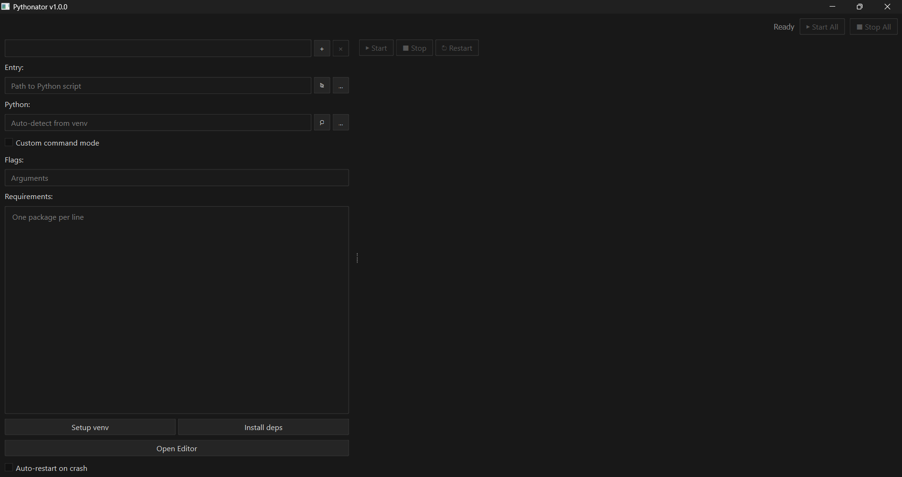
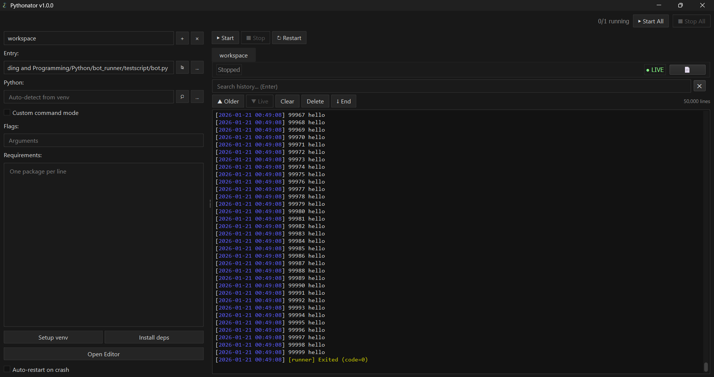
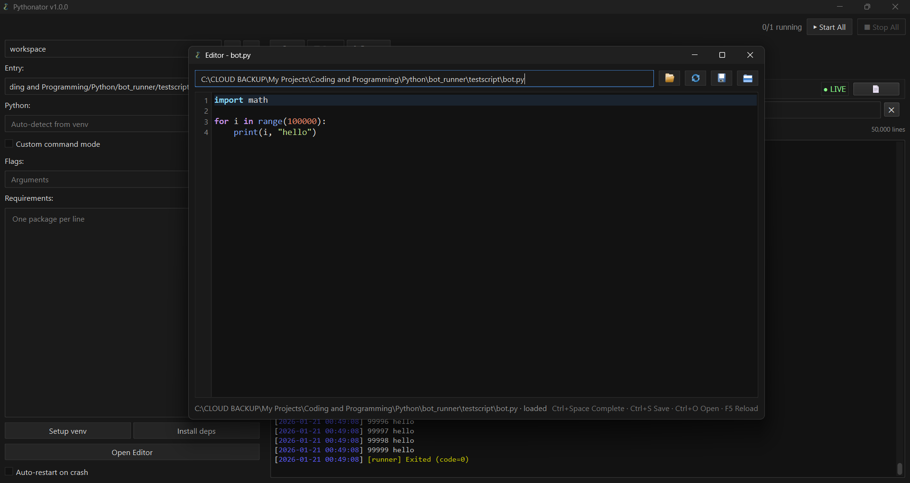
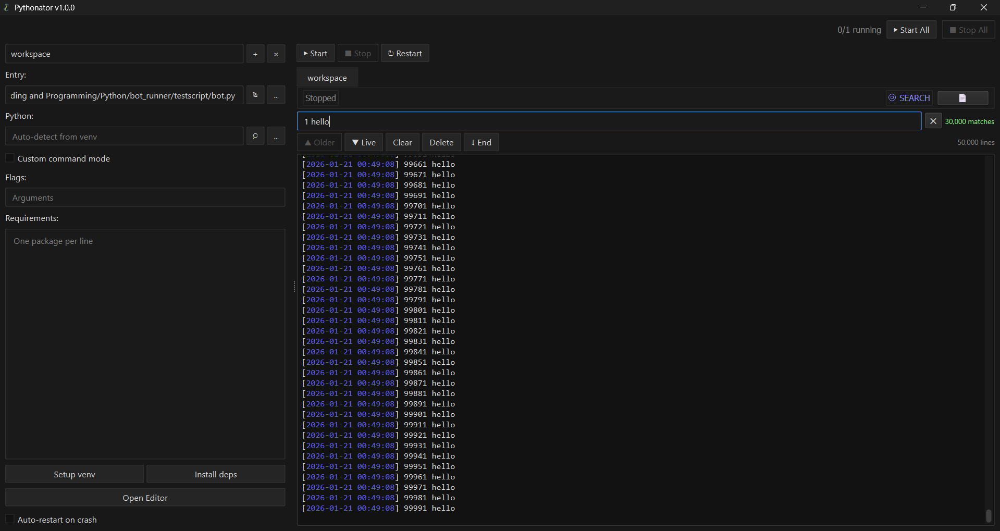

<p align="center">
  
  
  
</p>

<p align="center">
  <a href="https://github.com/cfunkz/Pythonator/stargazers">
    
  </a>
  <a href="https://github.com/cfunkz/Pythonator/issues">
    
  </a>
</p>

<p align="center" style="margin-top: 12px;">
  <a href="https://ko-fi.com/cfunkz81112">
    <strong>Buy me a coffee ☕</strong>
  </a>
</p>

# Pythonator

**Pythonator** is a desktop application for running, monitoring, and managing multiple Python scripts concurrently through a clean graphical interface.
It is designed for developers who want predictable process control, readable logs, and simple environment management without relying on multiple terminal sessions.

At its core, Pythonator is a **local Python process manager with a GUI**.

---

## Screenshots

<p align="center">
  
</p>

<p align="center">
  
  
</p>

<details>
  <summary><b>Venv setup & log history</b></summary>
  <br/>
  <p align="center">
    
  </p>
  <p align="center">
    
  </p>
</details>

---

## Capabilities

* ✅ Full ANSI color recognition (256-color, true color, bold, inverse)
* ✅ Multi-bot process management with isolation
* ✅ Separate execution paths for UI and processes (`QProcess`, `QThreadPool`)
* ✅ Live / History / Search log modes
* ✅ CPU and RAM usage monitoring (via `psutil`)
* ✅ Virtual environment creation and management
* ✅ Dependency installation from the UI
* ✅ Auto-restart on crash (optional)
* ✅ Integrated Python code editor
* ✅ Syntax highlighting and line numbers
* ✅ Jedi-based code completion (optional)
* ✅ Persistent log storage
* ✅ Dark theme by default

---

## What it does

* Runs **multiple Python scripts simultaneously**
* Assigns **one log tab per script**
* Displays logs exactly as produced by the process (ANSI-accurate)
* Provides **start / stop / restart** controls per script or globally
* Supports **custom commands** and script flags
* Tracks resource usage per process tree
* Keeps logs on drive for later inspection

---

## Why it exists

Pythonator was built to remove friction commonly encountered during local development:

* switching multiple terminals
* manually tracking virtual environments
* restarting crashed scripts
* inspecting large volumes of console output

It is particularly useful for:

* local bots and agents
* background workers
* small services
* development tooling
* long-running processes

---

## File structure

| File             | Purpose                                          |
| ---------------- | ------------------------------------------------ |
| `app.py`         | Application entry point, palette and theme setup |
| `config.py`      | Configuration, data models, shared styles        |
| `console.py`     | ANSI terminal emulator (256-color, true color)   |
| `log_buffer.py`  | Ring buffer with timestamps and persistence      |
| `log_view.py`    | Per-bot log viewer (live/history/search)         |
| `stats.py`       | CPU and RAM monitoring                           |
| `process_mgr.py` | Process lifecycle and isolation                  |
| `editor.py`      | Python editor with highlighting and completion   |
| `main_window.py` | Main application UI                              |

---

## Requirements

* Python **3.13+**
* `PyQt6` UI framework
* `psutil` CPU/RAM statistics
* `jedi` editor autocompletion (optional)

---

## Running the application

### Option 1: Run from source (any platform)

Requires Python **3.13+**.

```bash
git clone https://github.com/cfunkz/Pythonator.git
cd Pythonator
python app.py
```

---

### Option 2: Windows executable (no Python required for the app itself)

For Windows users, a prebuilt executable is available.

1. Download the latest release from:
   **[https://github.com/cfunkz/Pythonator/releases](https://github.com/cfunkz/Pythonator/releases)**
2. Download the **`.zip`** file for Windows
3. Extract it
4. Run `Pythonator.exe`

No Python environment is required **to run the application itself**.

> ⚠️ Note:
> To run Python scripts *inside* Pythonator, you will still need a Python installation or a configured Python interpreter path.
> The executable only bundles Pythonator, not a full Python runtime for user scripts.

---

### Platform notes

* **Windows**: Supported via executable (`.exe`)
* **macOS / Linux**: Run from source (for now)
* Logs, configs, and virtual environments are stored locally next to the application

No installer is required.

---

## Typical workflow

1. Create a new workspace
2. Select a Python script (or custom command)
3. Optionally edit the script using the built-in editor
4. Optionally configure a custom Python interpreter
5. Set up a virtual environment
6. Install dependencies
7. Start the process
8. Monitor logs and resource usage